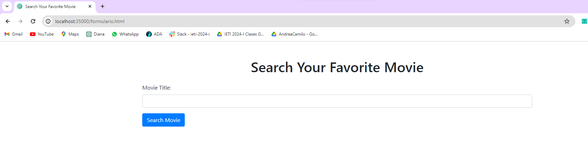
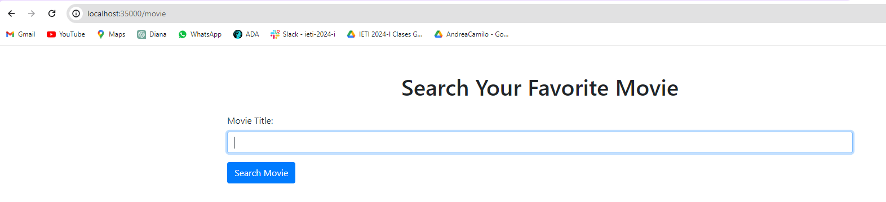
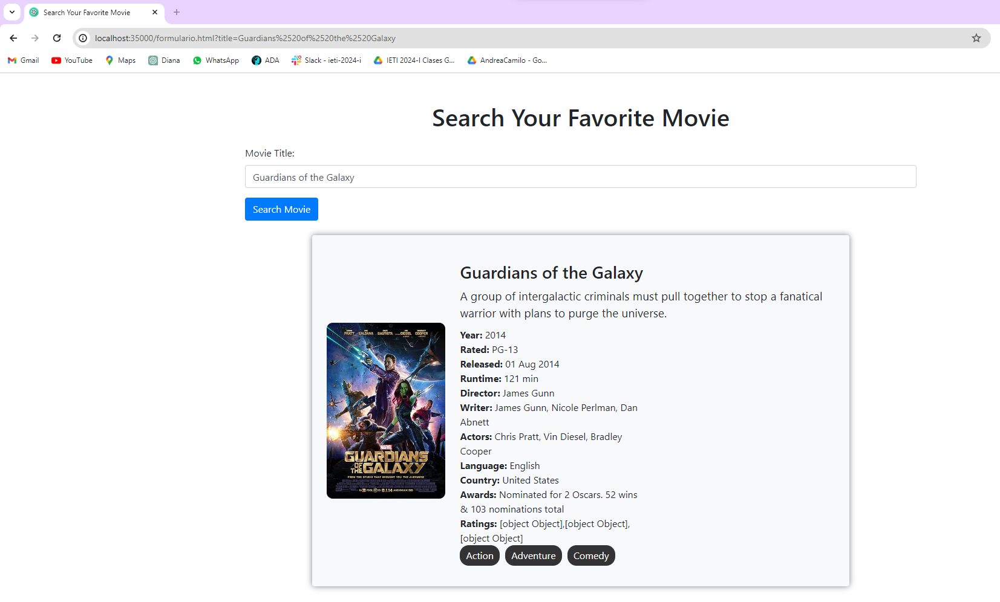
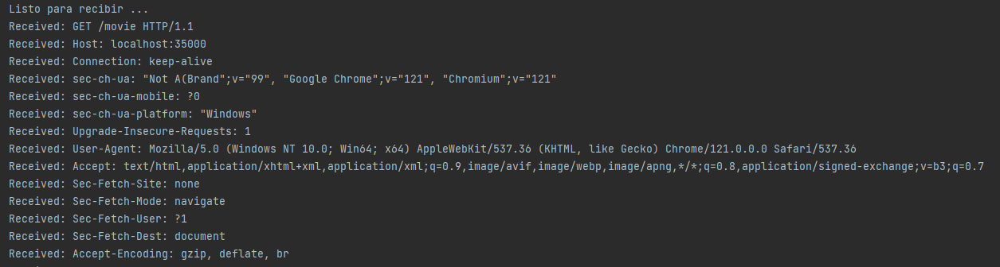
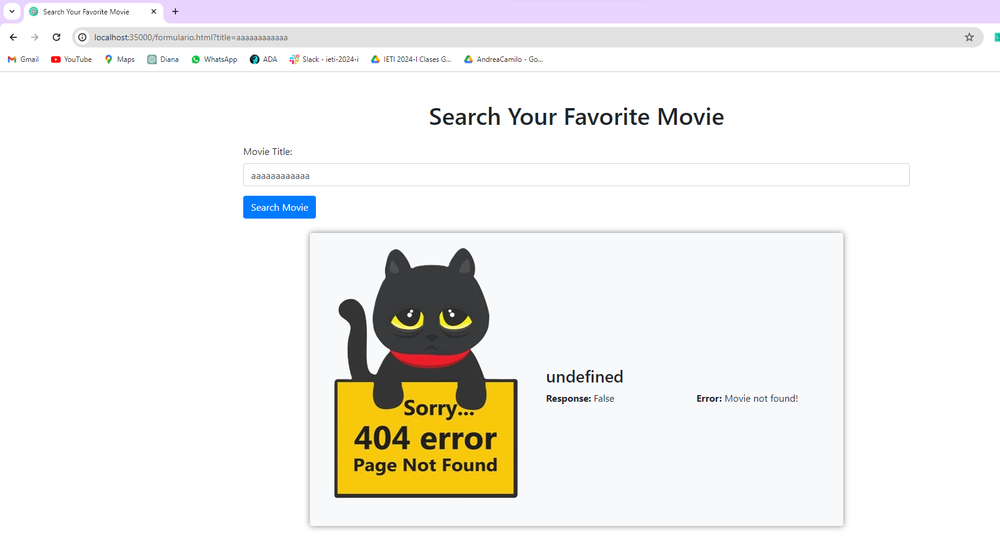
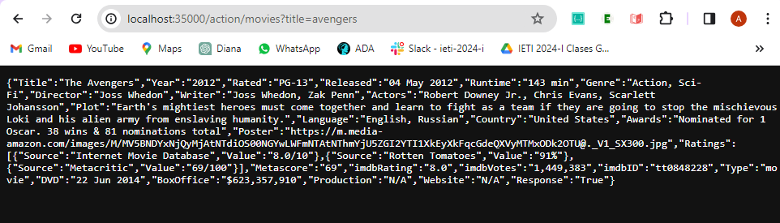
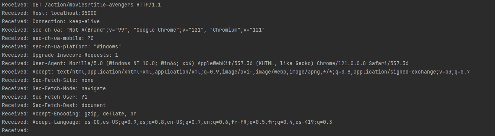
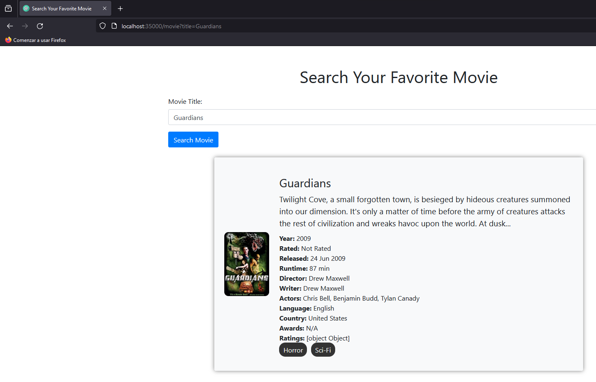

# AREP-Taller3

This project is a simple application HTTP server that allows users to search for movie information using the OMDb API. Additionally, it allows registration of get and post services using lambda functions.
The server responds to requests with details about a specific movie based on the movie title provided.
The server is capable of handling multiple requests in a row (not simultaneous) and serves static files, including HTML pages, JavaScript files, CSS, and images. Additionally, the web application incorporates asynchronous communication with REST services in the backend to obtain movie information from the OMDB API.
## Getting Started

These instructions will get you a copy of the project up and running on your local machine for development and testing purposes. See deployment for notes on how to deploy the project on a live system.

### Prerequisites

To run this project, you need to have the following installed:

- Java
- Maven
- Git

### Installing

Follow these steps to get a development environment running:

1. Clone the repository to your local machine:

```
git clone https://github.com/andreaduranvivas/AREP-Taller3
```

2. Build the project using Maven:

```
mvn clean install
```
3. Now you can use your favorite IDE to review and run the project. But it can also be run from the terminal using the following command:

```
mvn exec:java
```

4. Enter the folder where the MisServicios class of the project is located
Once all the project dependencies have loaded, you can run the main method of the MisServicios class. The terminal will send a message indicating that it is ready to listen, and that way you will know that you can start testing the server. 
To do this, you must enter from a browser to the URL http://localhost:3500/movie or http://localhost:3500/formulario.html, where you will find the page that allows you to search for movies and will return the data of the movie entered if it exists.
To search, you can press the search button or press the Enter key.

```
cd src/main/java/arep/clase/MisServicios.java
```

In case you want to test that the returned response is in "application/json", then you must change the url, you can put http://localhost:3500/action/movies/title=parameter. With this URL, a get request is made for the page that returns the response as json and you can see all the parameters with their values for that movie.

In summary, the lambda functions it allows are: get(path, function), post(path, function), getStaticFiles().location() -to change the location of static files- and getResponse().type(newType) -to change the type of the response to "application/json" or normal text-. Additionally, in the readQueryParams function of the Response class, we can read all the parameters of the query (we can see examples of the functions in the comments).

The image below shows an example of what the top of the page should look like.






In the search bar, you can enter the name of the movie. If the title exists within the external OMBD Api database, then it will return a result similar to the following image.
Here to change the title of the URL we make a post request.



In the console, we can see the verification of the use of the lambda function


Otherwise, that is, when the image does not exist, then the following page will appear



In case we want to see the information only in json format, we follow the URL of the image and change the title parameter


In the console, we can see the verification of the use of the lambda function



## Architecture

This project implements a simple Client-Server architecture for a web server capable of handling multiple consecutive (non-concurrent) requests. The application allows asynchronous communication with REST services on the backend, specifically using the OMDB API to obtain movie information.
### Project Structure

The project is organized as follows:

**1. src/main/java/arep/clase:** Contains the core classes and packages that form the basis of the web server.

- api (Package): Includes the MovieApiClient class, which is responsible for communicating with the OMDb API to fetch movie data.
- myspark (Package): Contains the LBSpark class, which sets up the server and routes incoming requests to the appropriate handlers. It also includes the handle subpackage with Function and PostFunction classes, which define the behavior for handling GET and POST requests.
- nuevasFunciones (Package): Houses the Response and StaticFiles classes, which assist in generating HTTP responses and serving static files, respectively.

- **2. resources/public:** Stores static resources served by the server, such as HTML files, images, CSS style sheets, and JavaScript scripts.


#### Main components

- **MovieApiClient (Java):** A class that encapsulates the logic for making HTTP requests to the OMDb API and parsing the JSON response.

- **LBSpark (Java):** The main class that configures a socket server and handles incoming requests. It uses the Function and PostFunction classes for routing and the Response and StaticFiles classes for generating responses.

- **Function, PostFunction (Java):** Interfaces that define the contract for handling GET and POST requests, allowing for flexibility in defining route behaviors.

- **Response, StaticFiles (Java):** Helper classes that provide utility methods for creating HTTP responses and managing static files.

- **formulario.html, movieSearch.js, movieStyles.css:** Static resources that make up the frontend of the web application, providing the user interface and interactivity.


### Use of Patterns and Modularity

**1. Client-Server Pattern:** The architecture follows the Client-Server model, where the server (LBSpark) manages the backend logic, while the client (MovieApiClient) handles the communication with the external OMDb API.
**2. Dependency Injection:** The use of interfaces (Function and PostFunction) allows for dependency injection, making it easier to swap out implementations for testing or future enhancements.
**3. Factory Method Pattern:** The LBSpark class acts as a factory for creating instances of Function and PostFunction, encapsulating the creation logic and promoting loose coupling.


### Extensibility and Maintainability

**1. Separation of Responsibilities:** The separation between server and client allows each component to be developed, tested, and maintained independently.

**2. Modularity in Static Resources:** Static resources (HTML, CSS, images, JavaScript) are organized in the public folder, making it easy to expand and modify without affecting other parts of the system.

**3. Reusable Components:** The Function and PostFunction interfaces, along with the Response and StaticFiles helper classes, can be reused across different projects or extended to support additional features.

**4. Clear Directory Structure:** The project's directory structure clearly separates source code from resources, making it easier for developers to navigate and understand the project's organization.

**5. Singleton Pattern:**The LBSpark class employs the Singleton pattern to ensure that there is only one instance of the server throughout the application's lifecycle. This design choice is particularly useful for coordinating actions across the system, especially when dealing with shared resources or configurations.

## Running the tests

To run the automated tests for this system, use the following Maven command:

```
mvn test
```


### Break down into end to end tests

The project includes tests to ensure the correctness and reliability of its components. Follow the instructions below to run the tests.

#### MovieApiClientTest

This test class focuses on the interaction with the OMDb API. You can write tests to ensure that the MovieApiClient correctly constructs the API request, handles the response, and properly processes any errors that may occur during the request.
```
mvn test -Dtest=MovieApiClientTest
```

#### MisServiciosTest
 It is is intended to test the server-side logic of our application
```
mvn test -Dtest=MisServiciosTest
```

### Integration testing

Most functions are tested by running the application in the browser. All the above tutorial was based on the application on Windows. The following image demonstrates the current project on Linux




No more tests were added because this workshop is based more on the use of styles with css, functions with javascript and images. And to do this, the reading of the page content in the HttpServer class was modified. So to verify its correct functioning, it is more advisable to access the page and see the styles and images loaded, as well as the correct functioning of the use of REST services.


## Documentation

The project includes Javadoc documentation to provide detailed information about the classes and methods. To generate the Javadoc documentation, execute the following command:

```
mvn javadoc:javadoc
```
After running this command, you can find the generated Javadoc in the target/site/apidocs/ directory. Open the index.html file in a web browser to browse the documentation.


## Built With

* [OMDb API](https://www.omdbapi.com/) - RESTful Web Service to Obtain Movie Information
* [Maven](https://maven.apache.org/) - Dependency Management
* [Java](https://www.java.com/es/) - Programming Language
* [JavaScript](https://developer.mozilla.org/en-US/docs/Web/javascript) - Programming Language
* [CSS](https://www.w3.org/Style/CSS/Overview.en.html) - stylesheet Language
* [HTML](https://html.com/) - HyperText Markup Language


## Versioning

Version 1.0.0

## Authors

* **Andrea Durán Vivas**  [Usuario de GitHub](https://github.com/andreaduranvivas)

## License

MIT License

## Acknowledgments

Class with Daniel Benavides